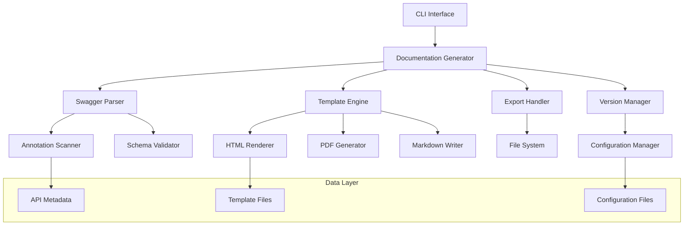

# Design Document

## Overview

API 文档自动生成系统是一个基于 Yii2 框架的文档生成工具，它能够扫描项目中的 Swagger/OpenAPI 注解，自动生成完整、准确、易于维护的 API 文档。系统采用模块化设计，支持多种输出格式，并可集成到 CI/CD 流程中。

## Architecture

系统采用分层架构设计，主要包含以下层次：



### 核心组件说明

1. **CLI Interface**: 命令行接口，提供用户交互和批处理功能
2. **Documentation Generator**: 核心控制器，协调各个组件的工作
3. **Swagger Parser**: 解析 Swagger/OpenAPI 注解，提取 API 信息
4. **Template Engine**: 模板引擎，负责文档的渲染和格式化
5. **Export Handler**: 导出处理器，支持多种格式的文档输出
6. **Version Manager**: 版本管理器，处理多版本 API 的文档生成

## Components and Interfaces

### 1. Swagger Parser Component

```php
interface SwaggerParserInterface
{
    public function scanDirectory(string $path): array;
    public function parseAnnotations(array $files): ApiMetadata;
    public function validateSchema(ApiMetadata $metadata): ValidationResult;
}

class SwaggerParser implements SwaggerParserInterface
{
    private AnnotationScanner $scanner;
    private SchemaValidator $validator;
    
    public function scanDirectory(string $path): array
    {
        // 扫描指定目录下的 PHP 文件
        // 返回包含 Swagger 注解的文件列表
    }
    
    public function parseAnnotations(array $files): ApiMetadata
    {
        // 解析文件中的 Swagger/OpenAPI 注解
        // 返回结构化的 API 元数据
    }
    
    public function validateSchema(ApiMetadata $metadata): ValidationResult
    {
        // 验证 API 元数据的完整性和正确性
        // 返回验证结果和错误信息
    }
}
```

### 2. Template Engine Component

```php
interface TemplateEngineInterface
{
    public function loadTemplate(string $templateName): Template;
    public function render(Template $template, ApiMetadata $data): string;
    public function registerHelper(string $name, callable $helper): void;
}

class TemplateEngine implements TemplateEngineInterface
{
    private array $templates = [];
    private array $helpers = [];
    
    public function loadTemplate(string $templateName): Template
    {
        // 加载指定的模板文件
        // 支持 HTML、Markdown 等格式
    }
    
    public function render(Template $template, ApiMetadata $data): string
    {
        // 使用模板渲染 API 数据
        // 返回格式化的文档内容
    }
    
    public function registerHelper(string $name, callable $helper): void
    {
        // 注册模板助手函数
        // 用于扩展模板功能
    }
}
```

### 3. Export Handler Component

```php
interface ExportHandlerInterface
{
    public function exportHtml(string $content, string $outputPath): bool;
    public function exportPdf(string $content, string $outputPath): bool;
    public function exportMarkdown(string $content, string $outputPath): bool;
}

class ExportHandler implements ExportHandlerInterface
{
    private HtmlRenderer $htmlRenderer;
    private PdfGenerator $pdfGenerator;
    private MarkdownWriter $markdownWriter;
    
    public function exportHtml(string $content, string $outputPath): bool
    {
        // 导出 HTML 格式文档
        // 包含 CSS 样式和 JavaScript 交互功能
    }
    
    public function exportPdf(string $content, string $outputPath): bool
    {
        // 导出 PDF 格式文档
        // 保持良好的排版和格式
    }
    
    public function exportMarkdown(string $content, string $outputPath): bool
    {
        // 导出 Markdown 格式文档
        // 符合标准 Markdown 语法
    }
}
```

### 4. Version Manager Component

```php
interface VersionManagerInterface
{
    public function detectVersions(string $projectPath): array;
    public function generateVersionDocs(array $versions, ApiMetadata $metadata): array;
    public function createVersionIndex(array $versionDocs): string;
}

class VersionManager implements VersionManagerInterface
{
    private SwaggerParser $parser;
    private TemplateEngine $templateEngine;
    
    public function detectVersions(string $projectPath): array
    {
        // 检测项目中的 API 版本
        // 基于模块目录结构（v1, v2, v3 等）
    }
    
    public function generateVersionDocs(array $versions, ApiMetadata $metadata): array
    {
        // 为每个版本生成独立的文档
        // 返回版本文档映射
    }
    
    public function createVersionIndex(array $versionDocs): string
    {
        // 创建版本索引页面
        // 提供版本切换功能
    }
}
```

## Data Models

### ApiMetadata Model

```php
class ApiMetadata
{
    public string $title;
    public string $version;
    public string $description;
    public array $servers;
    public array $paths;
    public array $components;
    public array $security;
    
    public function __construct(array $data = [])
    {
        // 初始化 API 元数据
    }
    
    public function addPath(string $path, PathItem $pathItem): void
    {
        // 添加 API 路径信息
    }
    
    public function addComponent(string $name, Component $component): void
    {
        // 添加可重用组件
    }
    
    public function validate(): ValidationResult
    {
        // 验证元数据的完整性
    }
}
```

### PathItem Model

```php
class PathItem
{
    public string $path;
    public array $operations; // GET, POST, PUT, DELETE 等
    public array $parameters;
    public string $summary;
    public string $description;
    
    public function addOperation(string $method, Operation $operation): void
    {
        // 添加 HTTP 操作
    }
    
    public function getOperation(string $method): ?Operation
    {
        // 获取指定方法的操作
    }
}
```

### Operation Model

```php
class Operation
{
    public string $operationId;
    public string $summary;
    public string $description;
    public array $tags;
    public array $parameters;
    public RequestBody $requestBody;
    public array $responses;
    public array $security;
    
    public function addParameter(Parameter $parameter): void
    {
        // 添加请求参数
    }
    
    public function addResponse(string $statusCode, Response $response): void
    {
        // 添加响应定义
    }
}
```

### Configuration Model

```php
class Configuration
{
    public string $projectPath;
    public array $scanPaths;
    public array $excludePaths;
    public string $outputPath;
    public string $templatePath;
    public array $exportFormats;
    public bool $validateAnnotations;
    public array $customSettings;
    
    public static function fromFile(string $configPath): self
    {
        // 从配置文件加载配置
    }
    
    public function merge(array $overrides): self
    {
        // 合并配置覆盖
    }
    
    public function validate(): ValidationResult
    {
        // 验证配置的有效性
    }
}
```

## Correctness Properties

*A property is a characteristic or behavior that should hold true across all valid executions of a system-essentially, a formal statement about what the system should do. Properties serve as the bridge between human-readable specifications and machine-verifiable correctness guarantees.*

### Property 1: Complete Annotation Scanning
*For any* directory containing PHP files with Swagger/OpenAPI annotations, the Swagger_Parser should identify and return all files containing valid annotations
**Validates: Requirements 1.1**

### Property 2: Accurate Information Extraction
*For any* valid API annotation, the Swagger_Parser should extract all required information including paths, HTTP methods, parameters, and response definitions
**Validates: Requirements 1.2**

### Property 3: Graceful Error Handling
*For any* file containing invalid or incomplete annotations, the system should log appropriate warnings while continuing to process other valid annotations
**Validates: Requirements 1.3**

### Property 4: Structured Data Return
*For any* completed parsing operation, the Swagger_Parser should return well-formed ApiMetadata objects that conform to the expected schema
**Validates: Requirements 1.4**

### Property 5: Complete Documentation Generation
*For any* set of API metadata, the Documentation_Builder should generate documentation that includes all interface paths and HTTP methods present in the source data
**Validates: Requirements 2.1**

### Property 6: Parameter Documentation Completeness
*For any* API operation with parameters, the generated documentation should display parameter names, types, required status, and descriptions for all parameters
**Validates: Requirements 2.2**

### Property 7: Response Documentation Completeness
*For any* API operation with response definitions, the generated documentation should include status codes, response formats, and example data for all responses
**Validates: Requirements 2.3**

### Property 8: Authentication Documentation
*For any* API operation requiring authentication, the generated documentation should clearly indicate the authentication method and permission requirements
**Validates: Requirements 2.4**

### Property 9: Multi-Version Documentation Generation
*For any* project structure containing multiple API version modules, the Version_Manager should generate independent documentation for each detected version
**Validates: Requirements 3.1**

### Property 10: Version Identification
*For any* generated version documentation, the output should contain clear version numbers and release date information
**Validates: Requirements 3.2**

### Property 11: Version Difference Highlighting
*For any* pair of API versions with interface differences, the Version_Manager should highlight and display the changes between versions
**Validates: Requirements 3.3**

### Property 12: Version Navigation
*For any* multi-version documentation set, the generated output should include functional version switching capabilities
**Validates: Requirements 3.4**

### Property 13: Template Format Support
*For any* custom template in HTML, CSS, or JavaScript format, the Template_Engine should successfully process and apply the template
**Validates: Requirements 4.1**

### Property 14: Content Integrity Preservation
*For any* template application operation, the Template_Engine should preserve the completeness and accuracy of the original documentation content
**Validates: Requirements 4.2**

### Property 15: Dynamic Content Rendering
*For any* template containing variables and loop structures, the Template_Engine should correctly render all dynamic elements
**Validates: Requirements 4.3**

### Property 16: Template Error Recovery
*For any* missing or malformed template file, the Template_Engine should fall back to default templates and log appropriate error information
**Validates: Requirements 4.4**

### Property 17: Batch Processing Support
*For any* command-line invocation with batch processing parameters, the API_Documentation_Generator should execute successfully in non-interactive mode
**Validates: Requirements 5.1**

### Property 18: Error Code Reporting
*For any* error condition during generation, the API_Documentation_Generator should return appropriate exit codes and descriptive error messages
**Validates: Requirements 5.2**

### Property 19: Generation Statistics Output
*For any* completed documentation generation, the system should output comprehensive statistics including file counts and output paths
**Validates: Requirements 5.3**

### Property 20: Output Directory Compliance
*For any* configured output directory, the API_Documentation_Generator should save all generated files to the specified location
**Validates: Requirements 5.4**

### Property 21: Export Format Support
*For any* export request, the Export_Handler should successfully generate documentation in HTML, PDF, and Markdown formats
**Validates: Requirements 6.1**

### Property 22: HTML Export Completeness
*For any* HTML export operation, the generated documentation should be self-contained and browsable offline
**Validates: Requirements 6.2**

### Property 23: PDF Format Preservation
*For any* PDF export operation, the generated document should maintain the original layout and formatting
**Validates: Requirements 6.3**

### Property 24: Markdown Standards Compliance
*For any* Markdown export operation, the generated file should conform to standard Markdown syntax rules
**Validates: Requirements 6.4**

### Property 25: Annotation Validation
*For any* scanned API annotation, the system should verify the presence and validity of all required fields
**Validates: Requirements 7.1**

### Property 26: Validation Reporting
*For any* annotation with missing required information, the system should generate detailed validation reports with specific issues identified
**Validates: Requirements 7.2**

### Property 27: Fix Suggestion Generation
*For any* annotation format error, the system should provide specific and actionable repair suggestions
**Validates: Requirements 7.3**

### Property 28: Validation Statistics
*For any* completed validation process, the system should provide accurate counts of passed and failed interface validations
**Validates: Requirements 7.4**

### Property 29: Configuration Loading
*For any* system startup, the API_Documentation_Generator should successfully read and apply configuration parameters from the configuration file
**Validates: Requirements 8.1**

### Property 30: Default Configuration Handling
*For any* missing configuration file scenario, the system should use default settings and create an example configuration file
**Validates: Requirements 8.2**

### Property 31: Invalid Configuration Recovery
*For any* invalid configuration parameter, the system should display error messages and fall back to default values
**Validates: Requirements 8.3**

### Property 32: Parameter Precedence
*For any* combination of configuration file settings and command-line parameters, the command-line parameters should take precedence
**Validates: Requirements 8.4**

## Error Handling

系统采用分层错误处理策略：

### 1. 输入验证层
- 验证配置文件格式和参数有效性
- 检查项目路径和文件权限
- 验证模板文件的存在性和格式

### 2. 解析处理层
- 捕获 Swagger 注解解析错误
- 处理文件读取和权限异常
- 管理内存和性能限制

### 3. 输出生成层
- 处理模板渲染错误
- 管理文件写入异常
- 验证输出格式的正确性

### 错误分类和处理策略

```php
enum ErrorLevel: string
{
    case FATAL = 'fatal';     // 停止执行
    case ERROR = 'error';     // 记录错误，继续执行
    case WARNING = 'warning'; // 记录警告，继续执行
    case INFO = 'info';       // 信息性消息
}

class ErrorHandler
{
    public function handleError(ErrorLevel $level, string $message, array $context = []): void
    {
        // 根据错误级别采取相应的处理策略
        // 记录日志、发送通知、停止执行等
    }
    
    public function getErrorSummary(): ErrorSummary
    {
        // 返回错误统计摘要
    }
}
```

## Testing Strategy

### 双重测试方法

系统将采用单元测试和基于属性的测试相结合的方法：

**单元测试**：
- 验证具体的示例和边界情况
- 测试组件间的集成点
- 验证错误条件和异常处理

**基于属性的测试**：
- 验证跨所有输入的通用属性
- 通过随机化实现全面的输入覆盖
- 每个属性测试运行最少 100 次迭代

### 测试框架配置

使用 PHPUnit 作为主要测试框架，集成 Faker 库进行数据生成：

```php
// 基于属性的测试示例
class SwaggerParserPropertyTest extends TestCase
{
    /**
     * @test
     * Feature: api-documentation-generator, Property 1: Complete Annotation Scanning
     */
    public function testCompleteAnnotationScanning(): void
    {
        // 生成随机的项目结构和注解
        // 验证扫描器是否识别所有有效注解
        for ($i = 0; $i < 100; $i++) {
            $projectStructure = $this->generateRandomProjectStructure();
            $result = $this->swaggerParser->scanDirectory($projectStructure->path);
            $this->assertContainsAllAnnotatedFiles($result, $projectStructure->annotatedFiles);
        }
    }
}
```

### 测试数据生成策略

为确保测试的全面性，系统将使用智能生成器：

1. **API 注解生成器**：生成各种有效和无效的 Swagger 注解
2. **项目结构生成器**：创建不同的目录结构和文件组织
3. **配置生成器**：生成各种配置组合和边界情况
4. **模板生成器**：创建不同格式和复杂度的模板文件

### 持续集成测试

测试将集成到 CI/CD 流程中：
- 每次代码提交触发完整测试套件
- 性能基准测试确保生成速度
- 文档质量检查验证输出格式
- 跨平台兼容性测试（Linux、macOS、Windows）